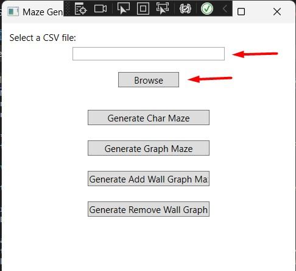
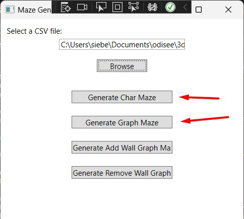
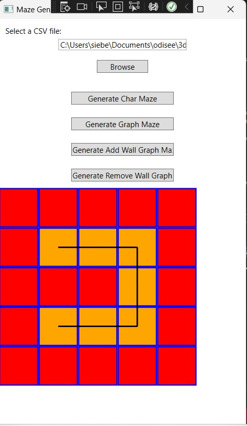
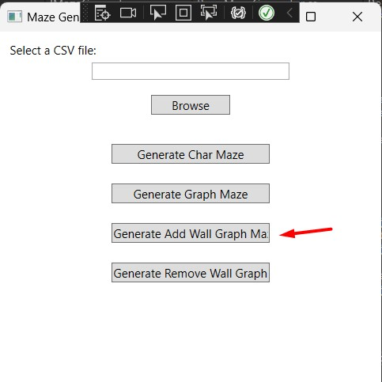
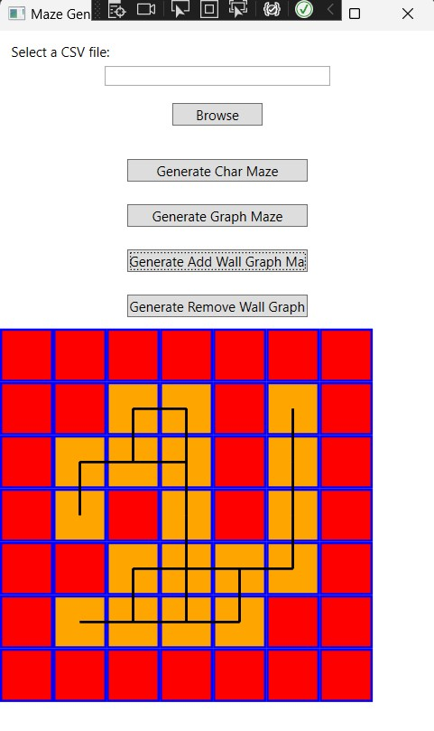
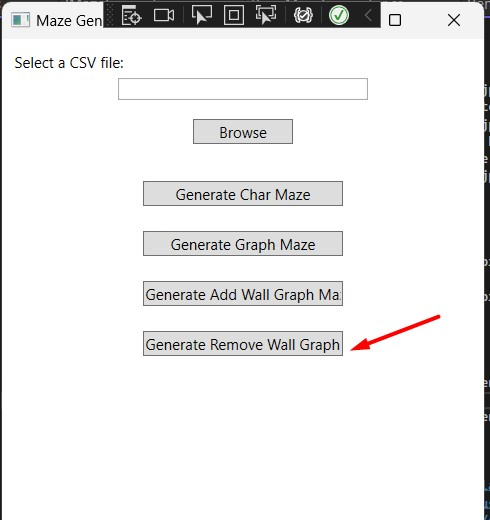
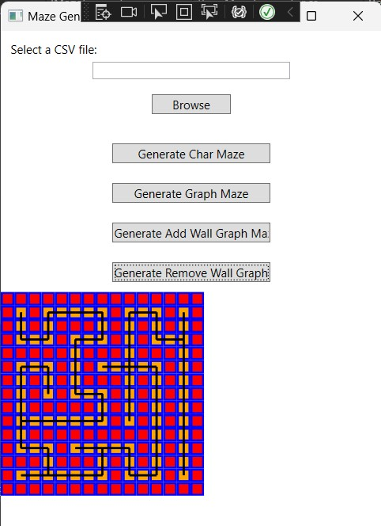

# 2324-AP-SiebeVandeVoorde

## Maze Generator

Dit is een leerproject voor applied programming. Het genereert doolhoven op 4 verschillende manieren.

### Overzicht van Projectstructuur

Deze applicatie volgt een model met drie lagen en afhankelijkheidsinjectie om deze lagen effectief met elkaar te verbinden. Hier is een uitsplitsing van de belangrijkste componenten:

#### App.xaml.cs (AppRoot - Klassebibliotheek)

- Het bestand `App.xaml.cs` binnen de klassebibliotheek `AppRoot` dient als het startpunt van onze applicatie.
- De opstartfunctie in `App.xaml.cs` is waar we diverse componenten initialiseren door hun respectievelijke fabrieken aan te roepen.
- Eerst roepen we de fabriek aan in de DataLayer, wat betekent dat we gegevens uit CSV-bestanden lezen.
- Vervolgens roepen we fabrieken aan in de LogicLayer om de overige drie scenario's te beheren.

#### DataLayer (Klassebibliotheek)

- De DataLayer bevat componenten die verantwoordelijk zijn voor gegevensgerelateerde bewerkingen, inclusief het lezen van gegevens uit CSV-bestanden.

#### LogicLayer (Klassebibliotheek)

- De LogicLayer is verantwoordelijk voor de kernlogica van onze applicatie.
- Het herbergt fabrieken voor het maken van instanties van klassen die specifieke interfaces implementeren.
- De eerste twee scenario's delen dezelfde fabriek, omdat ze deel uitmaken van dezelfde klasse.
- Klassen in deze laag zijn ontworpen om via interfaces aan MainWindow te worden doorgegeven.

##### Klassen in LogicLayer

- **AddWallMazeGenerator** en **RemoveWallMazeGenerator** implementeren beide dezelfde interface en vertegenwoordigen gedeeld gedrag.
- **BasicMazeGenerator** volgt een andere interface omdat het input van de frontend vereist, specifiek het bestandspad.

#### PresentationLayer (MainWindow)

- MainWindow, gelegen in de PresentationLayer, fungeert als de grafische gebruikersinterface (GUI) van onze applicatie.

Deze projectstructuur volgt een goed georganiseerde scheiding van verantwoordelijkheden, waarbij elke laag zijn eigen rol vervult. Afhankelijkheidsinjectie vergemakkelijkt de verbinding tussen lagen, waardoor een modulair en onderhoudsvriendelijk ontwerp mogelijk is.

### Model

De `Maze`-klasse maakt deel uit van de `Globals.Entities`-namespace en vertegenwoordigt een doolhofstructuur in een computerprogramma. Deze klasse is ontworpen om doolhoven te creëren, beheren en manipuleren, met name voor doolhofoplossingsapplicaties of -spellen.

#### Eigenschappen

- **Width** (int): Geeft de breedte van het doolhof weer.

- **Height** (int): Geeft de hoogte van het doolhof weer.

- **WallThickness** (int): Geeft de dikte van de doolhofcellen weer; zowel wanden als gangen zijn cellen.

- **BallPosition** (Coordinate): Geeft de huidige positie van een bal binnen het doolhof weer, en kan worden ingesteld.

- **MazeGraph** (UndirectedGraph<MazeNode, Edge<MazeNode>>): Vertegenwoordigt het doolhof als een ongerichte grafiek met behulp van de QuickGraph-bibliotheek. Het bevat knooppunten (vertegenwoordigd door `MazeNode`-objecten) en randen (vertegenwoordigd door `Edge<MazeNode>`-objecten) die de connectiviteit van het doolhof definiëren.

#### Constructor

##### `Maze(int width, int height, int wallThickness)`
- Initialiseert een nieuw exemplaar van de `Maze`-klasse met de opgegeven breedte, hoogte en wanddikte.
- Gooit een `ArgumentException` als de opgegeven dimensies of wanddikte ongeldig zijn (minder dan of gelijk aan 0).

#### Methoden

##### `ConnectAllNodes()`
- Legt verbindingen tussen doolhofknooppunten in de `MazeGraph` om de lay-out van het doolhof voor te stellen.
- Het doorloopt elke cel in het doolhof, verbindt knooppunten met hun aangrenzende buren en houdt rekening met open muren (@"^.{*}0").

##### `ChangeOtherNode(MazeNode currentNode)`
- Verandert de value van doolhofknooppunten in `MazeGraph` zodat de buur waarde klopt.
- Het doorloopt elke buur van een cel, verandert de aangrenzende buren en houdt rekening met open muren (@"^.{*}0").


##### `GetNeighbor(MazeNode node, int rowOffset, int colOffset)`
- Geeft de buur weer van een huidige node op de gevraagde plaats.
- Kijkt of de gevraagde buur een geldige node is, zoja wordt deze weergegeven.

#### Gebruik

Hier is een voorbeeld van hoe de `Maze`-klasse kan worden gebruikt:

```csharp
// Creëer een nieuw doolhof met afmetingen 10x10 en een wanddikte van 1
Maze mijnDoolhof = new Maze(10, 10, 1);

// Verplaats de bal binnen het doolhof
mijnDoolhof.MoveBall(1, 0); // Verplaats de bal één stap naar rechts

// Verbind alle knooppunten in het doolhof om de lay-out voor te stellen
mijnDoolhof.ConnectAllNodes();
```

### Algoritmen

#### `BasicMazeGenerator.cs`

#### Constructor

##### `public BasicMazeGenerator(IMazeDataAccess dataAccess)`
- verbindt de dataLayer.

#### Methoden

##### `public Maze GenerateGraphMaze(string filePath, int wallThickness)`

Deze public methode leest de file in en returned een maze.

**Parameters:**
- `filepath` (string): de locatie van de file.
- `wallThickness` (int): de dikte van de muren.

**Functionaliteit:**
- Kijkt of de file niet leeg is en returend een maze.

##### `private Maze ConvertToGraphMaze(string[] lines, int wallThickness)`

Deze private methode zet de array van strings met 4-bit binaire getallen om naar een maze en returned deze.

**Parameters:**
- `linesh` (string[]): array van stringss 4-bit binaire getallen.
- `wallThickness` (int): de dikte van de muren.

**Functionaliteit:**
- creert eerst een lege maze.
- neemt een 1 lijn en maakt hier een array van met verschillende 4-bit getallen
- voegt mazenodes toe met de values uit de array.

#### `AddWallMazeGenerator.cs`

##### `private void CreateNodes(Maze maze)`

Deze private methode zet alle cellen van het doolhof op ('0000').

**Parameters:**
- `maze` (Maze): Het doolhofobject om te genereren.

**Functionaliteit:**
- Overloopt de hoogte en breedte van het doolhof en plaatst een lege node in elke cel.

##### `private void AddRandomWalls(Maze maze)`

Deze private methode is verantwoordelijk voor het toevoegen van willekeurige muren aan een opgegeven doolhof. Het gebruikt het gegeven `Maze`-object om de `MazeGraph`-eigenschap ervan aan te passen.

**Parameters:**
- `maze` (Maze): Het doolhof waaraan willekeurige muren moeten worden toegevoegd.

**Functionaliteit:**
- Creert alle cellen zonder muren.
- Overloopt de totale hoeveelheid cellen.
- Neemt een random cel en verandert de value.
- Verandert de value van de buren zodat deze kloppen met de nieuwe value van de huidige node..

**Opmerking:**
- Muren worden binnen de `MazeGraph` van het doolhof gerepresenteerd door het teken (@"^.{*}1").

Deze methode draagt bij aan de generatie van een willekeurige doolhofstructuur, waarbij obstakels en complexiteit worden geïntroduceerd voor het navigeren in het doolhof.

#### `RemoveWallMazeGenerator.cs`

##### `private void GenerateMazeRecursive(Maze maze, int currentRow, int currentCol)`

Deze private methode genereert een doolhof recursief met behulp van een diepte-eerst algoritme.

**Parameters:**
- `maze` (Maze): Het doolhofobject om te genereren.
- `currentRow` (int): De huidige rijpositie binnen het doolhof.
- `currentCol` (int): De huidige kolompositie binnen het doolhof.

**Functionaliteit:**
- De methode genereert een willekeurige volgorde voor de richtingen (omhoog, omlaag, links, rechts) en schudt deze.
- Voor elke richting berekent het de positie van de volgende cel en controleert of het een geldige cel is binnen het doolhof.
- Het markeert de huidige muur als open, gerepresenteerd door het teken (@"^.{*}0") binnen de `MazeGraph` van het `maze`-object.
- Het markeert de buur muur als open, gerepresenteerd door het teken (@"^.{*}0") binnen de `MazeGraph` van het `maze`-object.
- Erna bezoekt het de volgende cel recursief en gaat het door met de generatie van het doolhof.

##### `private bool IsValidCell(Maze maze, int row, int col)`

Deze private methode controleert of een cel op een opgegeven rij- en kolompositie een geldige cel is voor doolhofgeneratie.

**Parameters:**
- `maze` (Maze): Het doolhofobject om te controleren.
- `row` (int): De rijpositie van de cel.
- `col` (int): De kolompositie van de cel.

**Returns:**
- `true` als de cel geldig is (binnen de grenzen van het doolhof en gesloten), anders `false`.

##### `private void Shuffle<T>(List<T> list)`

Deze private methode schudt de elementen in een lijst met behulp van het Fisher-Yates schudalgoritme.

**Parameters:**
- `list` (List<T>): De lijst die moet worden geschud.

**Functionaliteit:**
- Het doorloopt de lijst en wisselt willekeurig elementen om een willekeurige volgorde te bereiken.
- Deze methode wordt gebruikt om de richtingen voor doolhofgeneratie te schudden, waardoor willekeurigheid in de lay-out van het doolhof wordt gegarandeerd.

Deze functies werken samen om een doolhof te genereren met behulp van een recursief algoritme, waarbij wordt gezorgd dat het doolhof zowel geldig als willekeurig is voor een leuke en uitdagende ervaring.

### Grafische gebruikersinterface

#### Basis Doolhofgenerator (BasicMazeGenerator.cs)


1. **Selecteer een CSV-bestand:** U kunt een CSV-bestand kiezen vanaf uw pc door de pad ervan in het tekstvak in te voeren of eenvoudigweg de map te selecteren met behulp van de knop "Browse".


2. **Genereer het doolhof:** Druk op de knop "Generate Char Maze" of "Generate Graph Maze". Beide opties produceren hetzelfde doolhof, maar gebruiken verschillende methoden voor de creatie ervan.


3. **Bekijk het resultaat:** Het resulterende doolhof wordt vanonder weergegeven.

#### Doolhofgenerator met Muren Toevoegen (AddWallMazeGenerator.cs)


1. **Genereer het doolhof:** Druk op de knop "Generate Add Wall Graph Maze".


2. **Bekijk het resultaat:** Het gegenereerde doolhof wordt vanonder weergegeven.

#### Doolhofgenerator met Muren Verwijderen (RemoveMazeGenerator.cs)


1. **Genereer het doolhof:** Druk op de knop "Generate Remove Wall Graph Maze".


2. **Bekijk het resultaat:** Het gegenereerde doolhof wordt vanonder weergegeven.

### Reflectie

Het ontwikkelen van het "Maze Generator" project was een leerzaam proces waarbij ik verschillende aspecten van softwareontwikkeling heb verkend. Hier zijn enkele belangrijke inzichten en reflecties:

1. **Drie-Lagen Architectuur**: Het project volgde een drie-lagen architectuurmodel, waarbij ik duidelijk onderscheid maak tussen de presentatielaag, logische laag en datalaag. Deze aanpak hielp om de codebase georganiseerd en onderhoudsvriendelijk te houden.

2. **Dependency Injection**: Ik heb gebruikgemaakt van dependency injection om de verschillende lagen van onze toepassing met elkaar te verbinden. Dit maakte het mogelijk om afhankelijkheden op een flexibele en gecontroleerde manier te beheren.

3. **Maze Generatie**: Het implementeren van verschillende algoritmen voor doolhofgeneratie, zoals het willekeurig toevoegen van muren en het recursief genereren van doolhoven, was uitdagend maar lonend. Ik begrijp nu hoe doolhoven dynamisch kunnen worden gecreëerd en aangepast.

4. **Grafische Gebruikersinterface (GUI)**: Het ontwikkelen van de GUI met behulp van WPF was een interessante ervaring. Ik hebb geleerd hoe we gebruikersvriendelijke interfaces kunnen ontwerpen en interactieve elementen kunnen toevoegen.
											Hoewel deze mooier kan ben ik fan van simpele GUI's met weinig opmaak. Deze zijn vaak simpler en duidelijker te begrijpe.

5. **Code Organisatie**: Het belang van goed gestructureerde en gedocumenteerde code is duidelijk geworden. Het helpt niet alleen bij het begrijpen van de code, maar het oogt ook mooier.

6. **Testen en Debuggen**: Het testen van verschillende scenario's en het debuggen van problemen was een integraal onderdeel van het ontwikkelingsproces. Ik heb geleerd hoe belangrijk het is om code grondig te testen voordat deze in productie gaat.
						   Ook het Debuggen kan handig zijn voor het begrijpen van code voorbeelden. Zeker het recursief algoritme.

#### Bronnen

OpenAI. (2023). "ChatGPT". Available at: [ChatGPT](https://chat.openai.com/). Geraadpleegd op 05 oktober 2023.

## Maze Game

Dit is een spel dat gebruik maakt van de RemoveWallGenerator om een doolhof te genereren dat dan in 3D wordt weergegeven.

### Structuur

De structuur is nog steeds als hierboven vermeld is. Als enigste uitzondering is er een extra MainWindow en AppRoot bijgekomen.

### 3D Model

Het 3D-model wordt gegenereerd met behulp van de Helix Toolkit-bibliotheek. Het doolhof bestaat uit kubusvormige cellen die met elkaar verbonden zijn door muren. 
De bal, weergegeven als een sfeervormig object, beweegt door het doolhof en reageert op zwaartekrachteffecten.

### Detectie en Botsingen

De detectie van botsingen tussen de bal en de muren van het doolhof gebeurt door te controleren of de toekomstige positie van de bal overlapt met een muur. 
Dit wordt bereikt door de huidige positie van de bal te vergelijken met de naburige cellen en muren. Dit gebeurt in de methode `private bool CheckWallCollision(double x, double y)`
Deze doet dit door:
1. Te bepalen wat de huidige column en row is.
2. Het zoeken van de bijhoordende vertex
3. Bepalen van de verbindingen.
4. Bepalen van de Muurcoordinaten.
5. Decteren van botsingen
6. Als er geen botsingen zijn gedetcteerd mag de functie doorlopen en kan de bal van positie veranderen.

### Bronnen

OpenAI. (2023). "ChatGPT". Available at: [ChatGPT](https://chat.openai.com/). Geraadpleegd op 14 november 2023.
StackOverflow. Available at: [StackOverflow](https://stackoverflow.com/). Geraadpleegd op 14 november 2023.
HelixToolKit. Available at: [helix toolkit](https://github.com/helix-toolkit). Geraadpleegd op 14 november 2023.